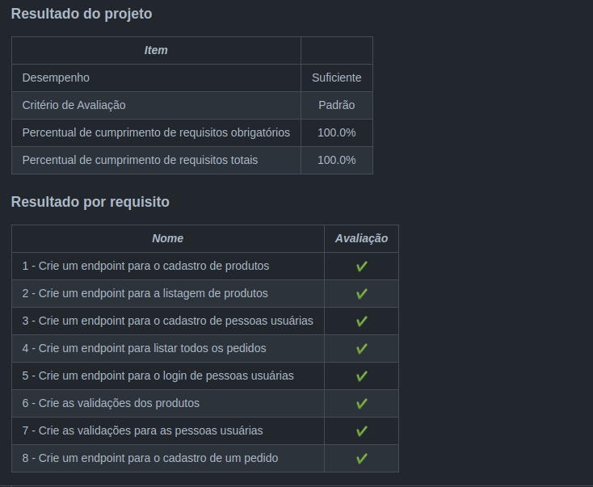

<h1>Sobre</h1>

Oitavo projeto do módulo 3 - Back-end, da <a href="https://betrybe.com" target="_blank">Trybe!</a>

Dessa vez foi o projeto Trybesmith. Como já vinha fazendo nos projetos anteriores, o desafio foi construir uma API para uma loja de itens medievais, criando todas as camadas (Model, Service e Controller), com CRUD para usuários, produtos e pedidos. Porém dessa vez também utilizei o TypeScript.

<h1>Instalando</h1>

Para instalar, basta executar o comando <code>npm install</code> no diretório raiz do projeto.

Logo depois, rode o comando <code>docker-compose up</code>, também, no diretório raiz do projeto. 

Por fim, execute o comando <code>npm start</code>

<h1>Tecnologias utilizadas</h1>

<ul>
  <li>docker</li>
  <li>MySQL</li>
  <li>Typescript</li>
  <li>Node.js</li>
  <li>Express</li>
  <li>Joi</li>
  <li>JWT</li>
</ul>

<h1>Nota</h1>

 